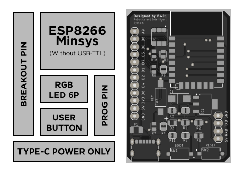
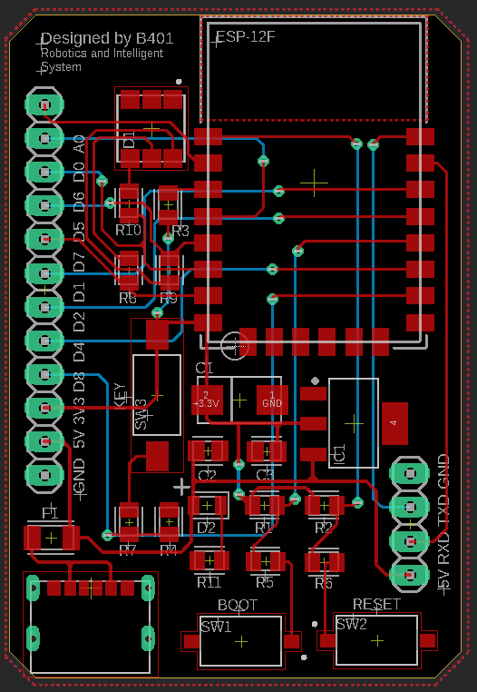
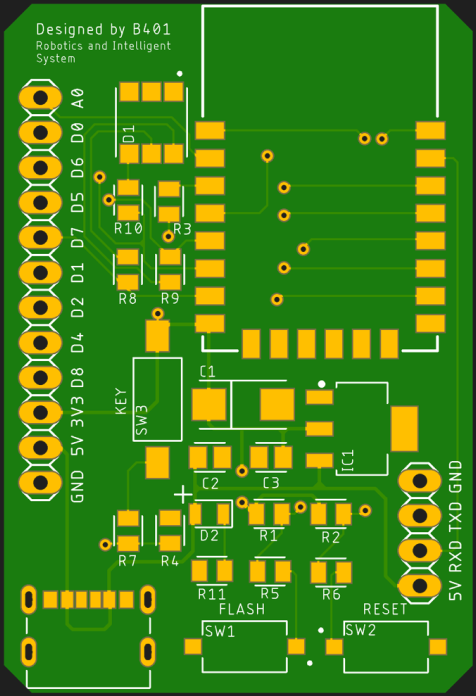
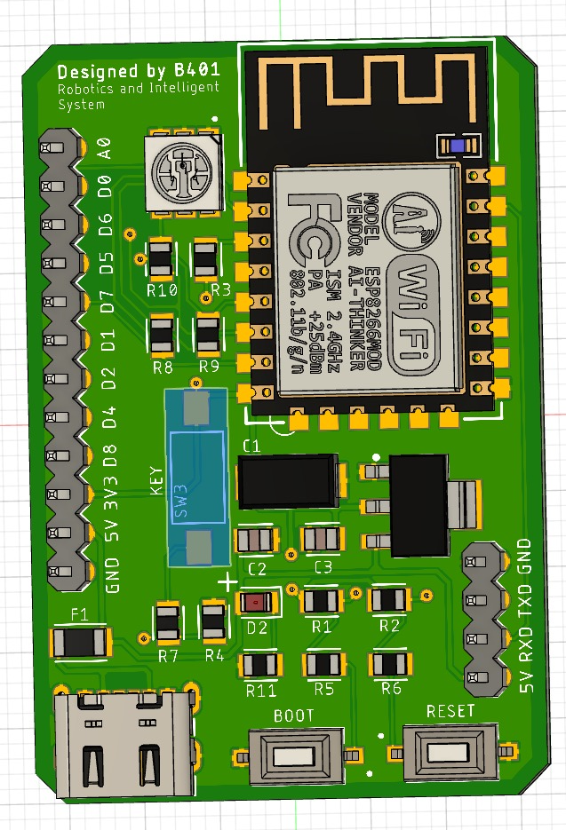

# **ESP8266 Minimum System**

_Workshop Telematika 2023_

## **Deskripsi**

Dokumentasi ini dibuat untuk memudahkan peserta workshop dalam memahami dan mengembangkan ESP8266 Minimum System pada Workshop Telematika 2023.

Diagram Fitur ESP8266 Minimum System dan PCB dapat dilihat pada gambar berikut.

## Hardware

Gambar dibawah merupakan design hardware ESP8266 Minimum System yang akan digunakan pada workshop.

<table>
                <tr>
                    <th>Jalur PCB</th>
                    <th>Hasil Gerber</th>
                    <th>Gambar 3D</th>
                </tr>
                <tr>
                    <td></td>
                    <td></td>
                    <td></td>
                </tr>
</table>

Untuk dokumentasi hardware, silahkan lihat [/hardware](hardware/readme.md)

## Firmware

Untuk dokumentasi firmware, silahkan lihat [/firmware](firmware/readme.md)

## Kontribusi

Kami sangat terbuka terhadap kontribusi dari semua pihak. Jika Anda ingin berkontribusi dengan memperbaiki atau melengkapi template ini, silakan buat pull request ke repositori template kami.

