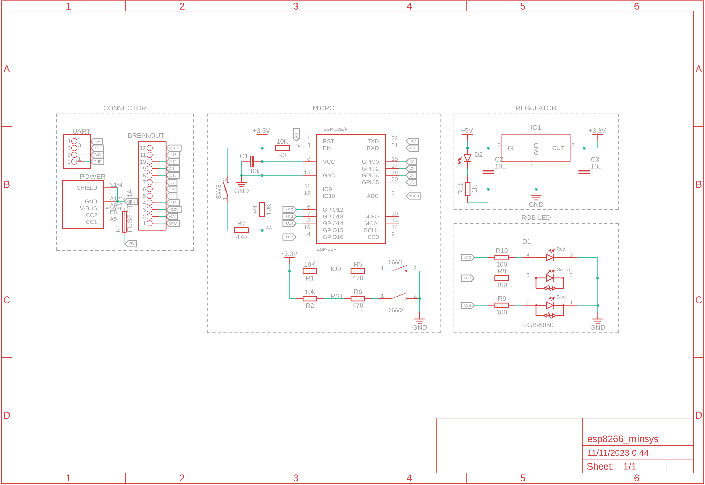

# **Dokumentasi Hardware**

## Software

- [Eagle](https://www.autodesk.com/products/eagle/overview) (Untuk membuka file .sch dan .brd)
- [Fusion 360](https://www.autodesk.com/products/fusion-360/overview) (Alternatif)

## Schematic

Gambar dibawah merupakan schematic ESP8266 Minimum System yang akan digunakan pada workshop.

## Bill of Material

| Designator | Quantity | Package | Value |      Description      |
| :--------: | :------: | :-----: | :---: | :-------------------: |
|  R1 - R4   |    4     |  0805   |  10K  |       Resistor        |
|  R5 - R7   |    3     |  0805   |  330  |       Resistor        |
|  R8 - R10  |    3     |  0805   |  100  |       Resistor        |
|    R11     |    1     |  0805   |  1K   |       Resistor        |
|     C1     |    1     |  2412   | 100u  |       Kapasitor       |
|  C2 - C3   |    2     |  0805   |  10u  |       Kapasitor       |
|     D1     |    1     |  5050   |  RGB  |          LED          |
|     D2     |    1     |  0805   |  Red  |          LED          |
|    SW1     |    1     |    -    |   -   |    Push Button (1)    |
| SW2 - SW3  |    1     |    -    |   -   |    Push Button (2)    |
|    IC1     |    1     | SOT-223 |  3V3  | Voltage Regulator 3V3 |
|     F1     |    1     |  1206   | 750mA |         Fuse          |
|     J1     |    1     |    -    |  6P   |      USB Type-C       |
